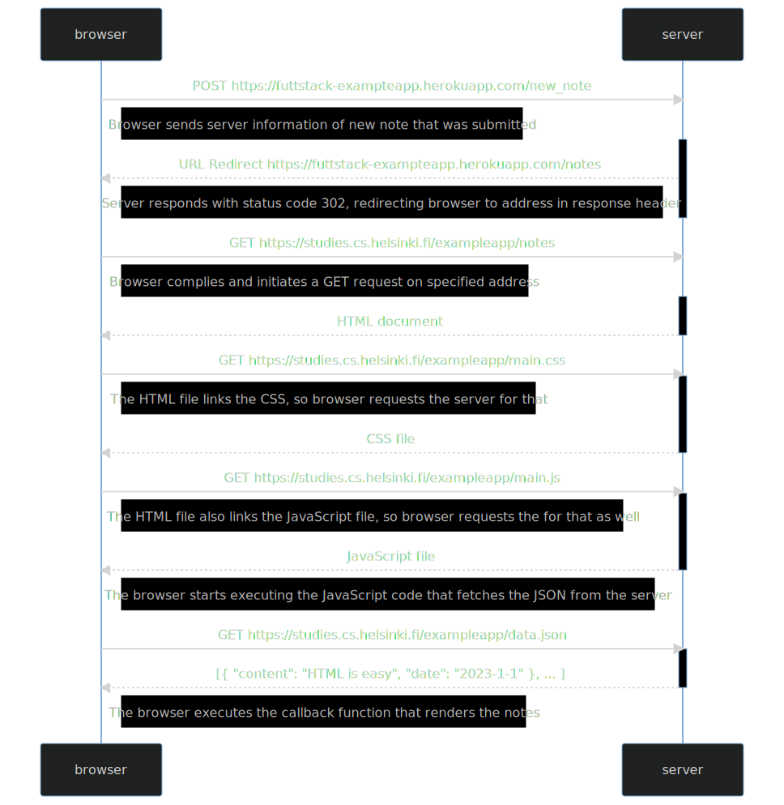

# Mermaid Code:

```
sequenceDiagram
participant browser
participant server

    browser->>server: POST https://futtstack-exampteapp.herokuapp.com/new_note
    note right of browser: Browser sends server information of new note that was submitted
    activate server
    server-->>browser: URL Redirect https://futtstack-exampteapp.herokuapp.com/notes
    note right of browser: Server responds with status code 302, redirecting browser to address in response header
    deactivate server

    browser->>server: GET https://studies.cs.helsinki.fi/exampleapp/notes
    note right of browser: Browser complies and initiates a GET request on specified address
    activate server
    server-->>browser: HTML document
    deactivate server

    browser->>server: GET https://studies.cs.helsinki.fi/exampleapp/main.css
    activate server
    note right of browser: The HTML file links the CSS, so browser requests the server for that
    server-->>browser: CSS file
    deactivate server

    browser->>server: GET https://studies.cs.helsinki.fi/exampleapp/main.js
    activate server
    note right of browser: The HTML file also links the JavaScript file, so browser requests the for that as well
    server-->>browser: JavaScript file
    deactivate server

    Note right of browser: The browser starts executing the JavaScript code that fetches the JSON from the server

    browser->>server: GET https://studies.cs.helsinki.fi/exampleapp/data.json
    activate server
    server-->>browser: [{ "content": "HTML is easy", "date": "2023-1-1" }, ... ]
    deactivate server

    Note right of browser: The browser executes the callback function that renders the notes
```

# Preview:


