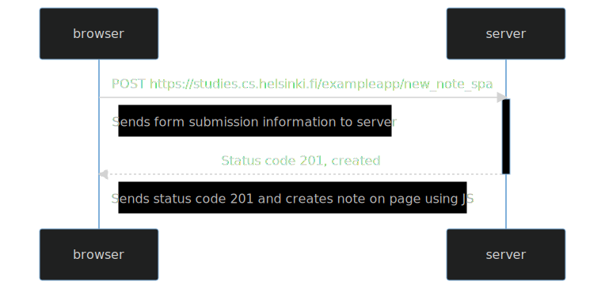

# Mermaid Code:

```
sequenceDiagram
    participant browser
    participant server

    browser->>server: POST https://studies.cs.helsinki.fi/exampleapp/new_note_spa
    activate server
    note right of browser: Sends form submission information to server
    server-->>browser: Status code 201, created
    deactivate server
    note right of browser: Sends status code 201 and creates note on page using JS
```

# Preview:


